# I. Thu thập và chuẩn bị bộ dữ liệu
Xây dựng nguồn dữ liệu PCB phục vụ cho bước tiền xử lý, huấn luyện và đánh giá vector đặc trưng.
- Dataset PCB từ GitHub
- Dataset PCB từ Kaggle

Sau đó gộp thành tập ảnh tổng hợp từ 2 Dataset trên

# II. Phân chia dữ liệu
PCB - 80% Train | 10% Val | 10% Test.

# III. Tiền xử lý ảnh & Phân thư mục
## 1. Bước đầu xử lý
Với ảnh ban đầu loại bỏ nền và viền thừa có thể chứa thông tin nhiễu cho PCB khi trích xuất.
## 2. Chia PCB thành patch
Chia thành từng patch: Mỗi PCB chia và lấy tối đa 12 patch với kích thước [128, 128] (Ko lấy hết patch, sử dụng làm mịn ảnh tăng độ nét của ảnh).
## 3. Xây dựng tập Normal/Defect
Với nguồn từ Kaggle là ảnh tổng hợp không lỗi, tiến hành sinh lỗi nhân tạo đa dạng. Với nguồn từ GitHub có ít ảnh chuẩn, tiến hành tăng cường dữ liệu cho ảnh chuẩn.

Tổng hợp lại tạo thành 2 lớp dữ liệu:

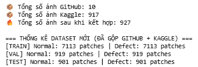

# IV. Xây dựng mô hình trích xuất đặc trưng 
## 1. Pipeline mô hình thuật toán
Ảnh các patch(128, 128, 3) - MobilenetV2 - Global Average Pooling - Dense 256 - BatchNorm + ReLU - Dropout 0.3 - Dense 64 - BatchNorm + ReLU - Dense 32 - L2 Normalization - Vector đặc trưng 32D

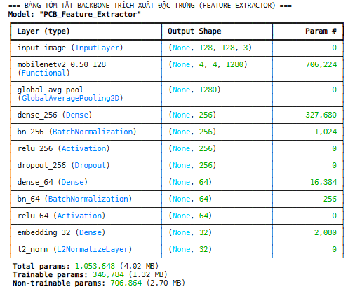
## 2. Quá trình
- Dùng MobilenetV2 làm Backbone trích xuất đặc trưng (sử dụng trọng số từ imagenet).
- GlobalAveragePooling2D Tổng hộp từ Feature Map thành vector đặc trưng đưa tới Dense- Dense (256 - 64 - 32).
- L2 Normalize giúp so sánh các vector bằng khoảng cách trở nên chuẩn chỉ hơn.

- Xây dựng Triplet Dataset (Anchor - Positive - Negative).
Mục tiêu là Anchor gần Positive và Anchor xa Negative và khoảng cách tối thiểu là margin .

# V. Huấn luyện mô hình trích xuất đặc trưng 
## 1. Giai đoạn 1 (Huấn luyện tầng Embedding)
Tạm thời backbone đang đóng băng tập trung học ánh xạ đặc trưng từ imagenet sang không gian embedding phù hợp với dữ liệu PCB.
## 2. Giai đoạn 2 (Fine-tuning)
Mở khóa 30 tầng cuối cùng của MobilenetV2 để mô hình thích nghi các đặc trưng đã học với Data từ PCB của Kaggle và GitHub.

Cuối cùng xuất file .keras là file mô hình trích xuất đã đc huấn luyện.

# VI. Đánh giá mô hình vừa rồi
## 1. Các hệ số (accuracy, precision, recall và f1-score)

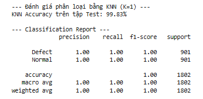
## 2. Ma trận Nhầm lẫn và Không gian Embedding bằng t-SNE
    
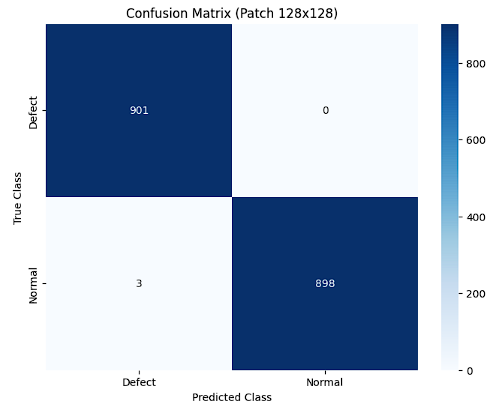

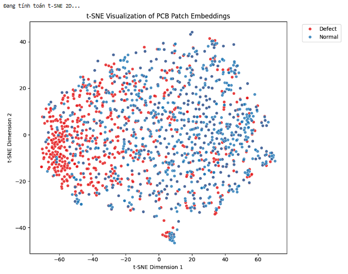
## 3. Vector trích xuất được từ ảnh
### 3.1) Tập test thử 

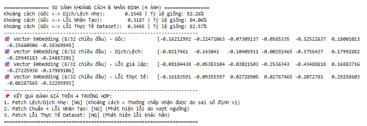
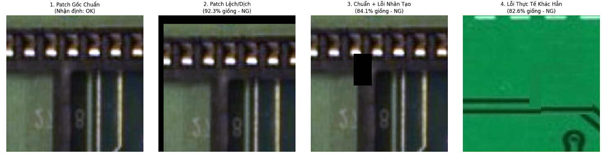
### 3.2) Tập test thực tế
### 3 ảnh là Perfect, Fair, Defect
    
### Perfect và Fair khá oke nên chủ yếu so sánh Perfect với Defect 
- Chia ảnh của Defect thành giả sử 4x4 patch và resize về [128, 128] so sánh với Perfect cx làm tương tự vậy.

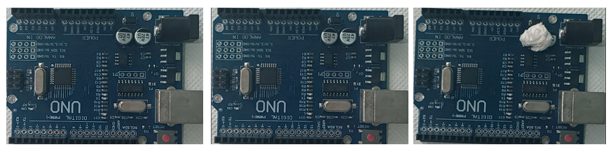
    
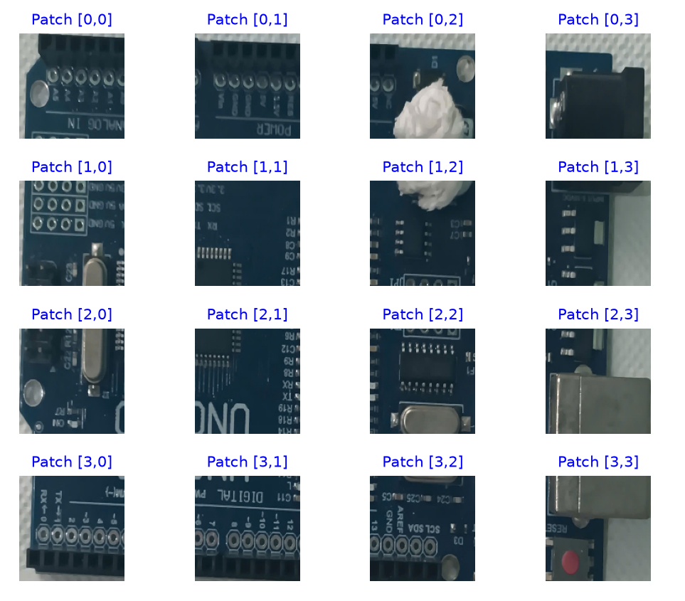
### Lỗi thực tế ở Patch [0, 2] và [1, 2]

### Lỗi kiểm thử

DANH SÁCH CÁC PATCH KHÁC BIỆT / CÓ DẤU HIỆU LỖI (Dưới 93.0%):
#### - Patch [2] (Hàng 0, Cột 2) -> Fair: 99.71% | Defect: 78.80% 
    Vector Perfect (8 chiều đầu): [0.8244 1.479  0.     0.6524 0.     0.     0.     2.9384]
    Vector Fair    (8 chiều đầu): [0.6553 1.5464 0.     0.799  0.     0.     0.     2.7947]
    Vector Defect  (8 chiều đầu): [3.1734 3.3088 0.     0.382  2.8871 0.1641 0.     2.0438]

#### - Patch [6] (Hàng 1, Cột 2) -> Fair: 99.19% | Defect: 82.94%
    Vector Perfect (8 chiều đầu): [1.6937 0.6656 0.     0.     0.5455 0.     0.     1.9601]
    Vector Fair    (8 chiều đầu): [1.6398 0.7068 0.     0.     0.7157 0.     0.     1.6617]
    Vector Defect  (8 chiều đầu): [2.712  0.9838 0.     0.     2.0034 0.2634 0.     0.5084]

#### - Patch [10] (Hàng 2, Cột 2) -> Fair: 97.26% | Defect: 88.60%
    Vector Perfect (8 chiều đầu): [2.8451 1.9526 0.     0.     2.8943 0.     0.     2.4859]
    Vector Fair    (8 chiều đầu): [3.043  2.3424 0.     0.     3.1861 0.     0.     1.4879]
    Vector Defect  (8 chiều đầu): [2.8176 2.6884 0.     0.4542 3.3908 0.     0.     0.8291]

> Kết luận: Bị nhầm lẫn Patch [2, 2]

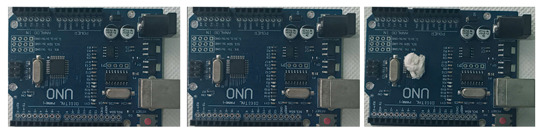

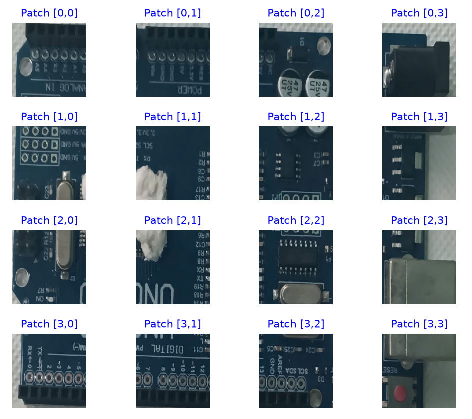
### - Lỗi thực tế ở Patch [1, 1], [2, 1] và hơi sang [1, 0]

### - Lỗi kiểm thử
DANH SÁCH CÁC PATCH KHÁC BIỆT / CÓ DẤU HIỆU LỖI (Dưới 93.0%):
#### - Patch [5] (Hàng 1, Cột 1) -> Fair: 98.31% | Defect: 90.86%
    Vector Perfect (8 chiều đầu): [1.3845 0.3313 0.     0.     2.3757 0.1575 0.     1.3229]
    Vector Fair    (8 chiều đầu): [1.7755 0.     0.     0.     2.5977 0.0179 0.     2.0892]
    Vector Defect  (8 chiều đầu): [0.7161 1.6478 0.     0.     3.6034 0.     0.     2.7888]

#### - Patch [6] (Hàng 1, Cột 2) -> Fair: 99.19% | Defect: 91.98%
    Vector Perfect (8 chiều đầu): [1.6937 0.6656 0.     0.     0.5455 0.     0.     1.9601]
    Vector Fair    (8 chiều đầu): [1.6398 0.7068 0.     0.     0.7157 0.     0.     1.6617]
    Vector Defect  (8 chiều đầu): [1.4381 0.6654 0.     0.     0.2345 0.     0.     1.7978]

#### - Patch [10] (Hàng 2, Cột 2) -> Fair: 97.26% | Defect: 91.62%
    Vector Perfect (8 chiều đầu): [2.8451 1.9526 0.     0.     2.8943 0.     0.     2.4859]
    Vector Fair    (8 chiều đầu): [3.043  2.3424 0.     0.     3.1861 0.     0.     1.4879]
    Vector Defect  (8 chiều đầu): [2.8978 2.5425 0.     0.3002 3.3226 0.     0.     1.0321]

> Kết luận: Lại bị Patch [2, 2] ??
### 3.2) Với tập test theo phương pháp Patchcore
Học 10 ảnh chuẩn cắt theo 7x7 và lưu 75 vector chuẩn nhất vào Memory_Bank.

ẢNH trong tập đã đc học.
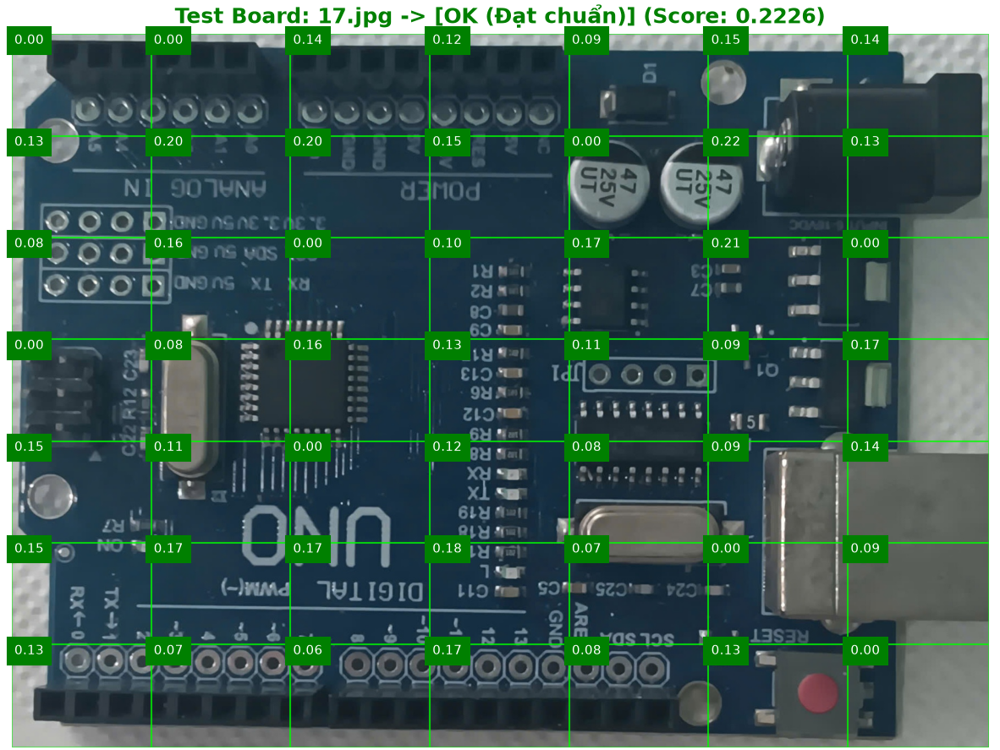

> => KẾT LUẬN HỆ THỐNG: OK (Đạt chuẩn)

Ảnh tương tự thế nhưng ngoài tập học.
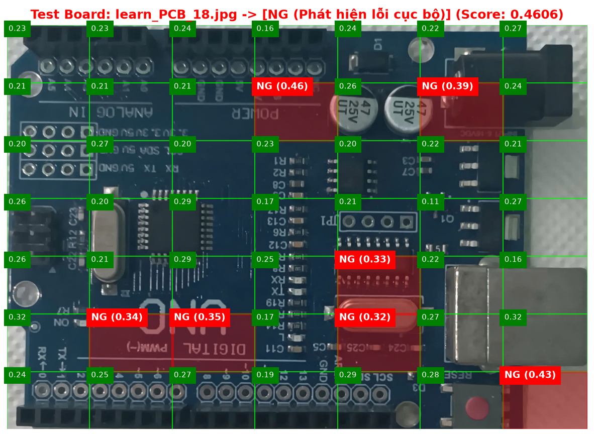

> => KẾT LUẬN HỆ THỐNG: NG (Phát hiện lỗi cục bộ)
Đoạn này test giảm patch xuống 6x6 5x5 thì lỗi nhận đc mạch lỗi (3-5 lỗi).

Ảnh lỗi 
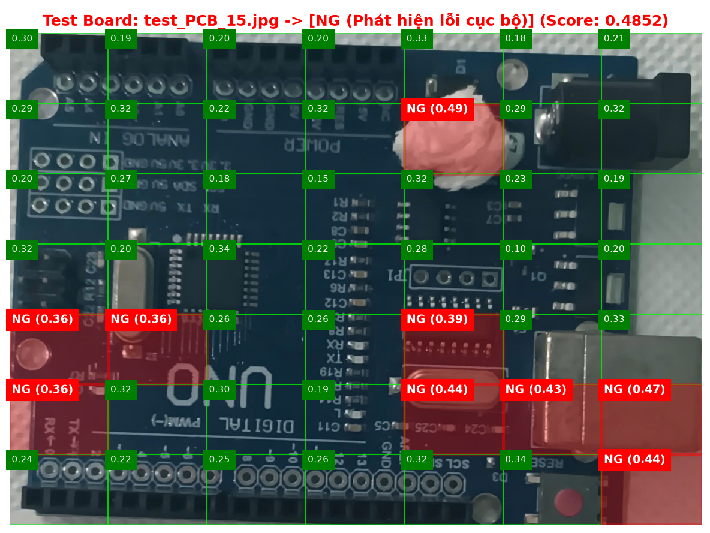

> => KẾT LUẬN HỆ THỐNG: NG (Phát hiện lỗi cục bộ)

Mặc dù có nhận đc ô lỗi nhưng bị tràn ra nhận thêm ô ko lỗi là ô lỗi khá nhiều.