# Bảng Confusion Matrix

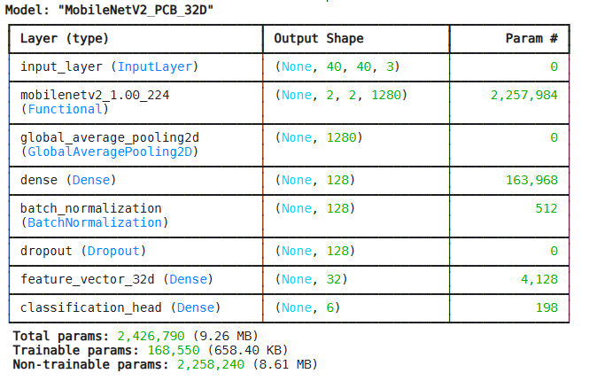
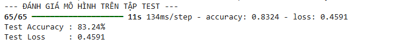
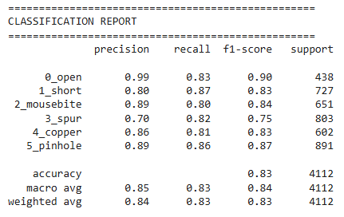
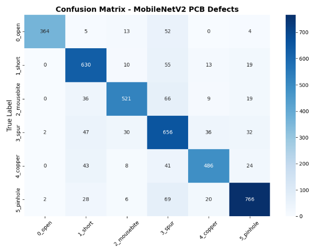
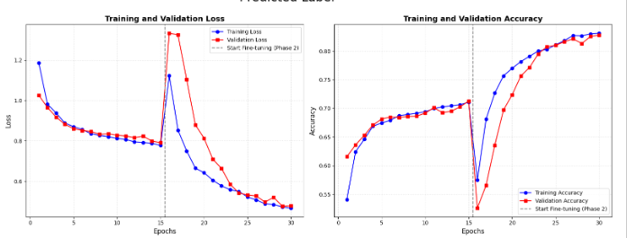

+ Kích thước đầu vào là (40 40 3) ảnh màu
+ Tổng tham số (Total Params) là 2.426.790 params tương ứng 9.26MB
+ Non-trainable params là 2.258.550 params tương ứng 8.61MB về phần giữ nguyên bộ trích xuất đặc trưng tống quan từ 'Imagenet'
+ Trainable params là 168.550 params tướng ứng 648.40KB nằm ở lớp GlobalAveragePooling2D, Dense, Dropout, BatchNormalization

# Thống kê các lớp 

+ Số lớp Convolution
    + Conv2d có 35 lớp
    + DepthwiseConv2D cso 17 lớp 
+ Số lớp Pooling là 1 lớp GlobalAveragePooling2D
+ Số lớp Fully Connected là 3 lớp (Gồm 3 lớp Dense)
    + Dense 1280 -> 128 Nén đặc trưng
    + Dense 128 -> 32 Tạo feature vector
    + Dense 32 -> 6 Phân loại 6 nhãn 
## Các lớp khác 

+ GlobalAveragePooling2D có 1 lớp (Chuyển feature map thành vector)
+ BatchNormalization có 1 lớp (Ổn định quá trình học)
+ Dropout (Giảm overfitting)
+ Softmax (Phân loại)

# Nguồn từ Dataset

https://www.kaggle.com/datasets/akhatova/pcb-defects/data?select=PCB_DATASET
https://www.kaggle.com/datasets/arnablaha05/deep-pcb

Ảnh train và test là 40x40 

# Sau lượng tử hóa xuống INT8

+ feature_extractor_32d_int8.tflite (Dung lượng: 700.35 KB)

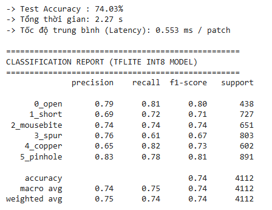
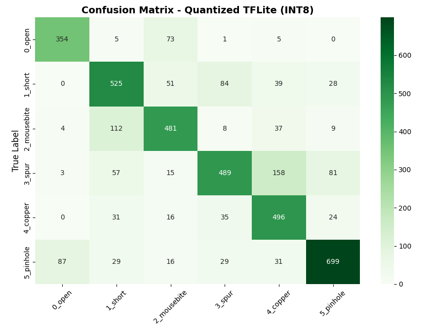

# Quá trình thử nghiệm mô hình

Sau khi xuất ra file feature_extractor_32d.h5, mình sẽ loại bỏ lớp cuối cùng là 'softmax' tập     trung vào lớp 'feature_extractor' trước đó mục đích là bỏ đi lớp phân loại giữ loại lớp trích xuất đặc trưng chính.

## Với tập test 

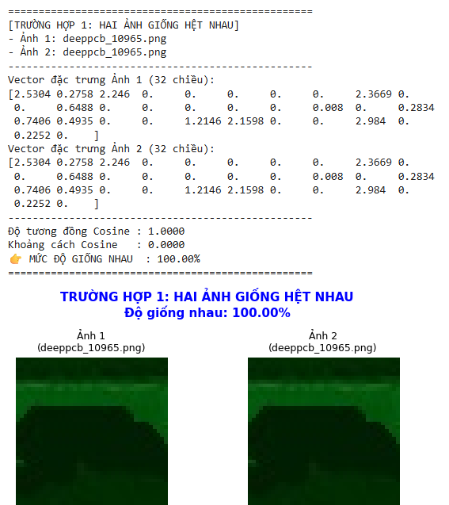
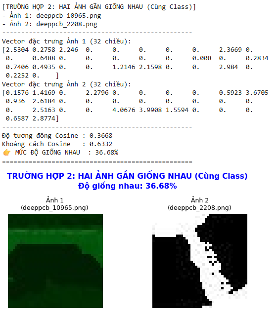
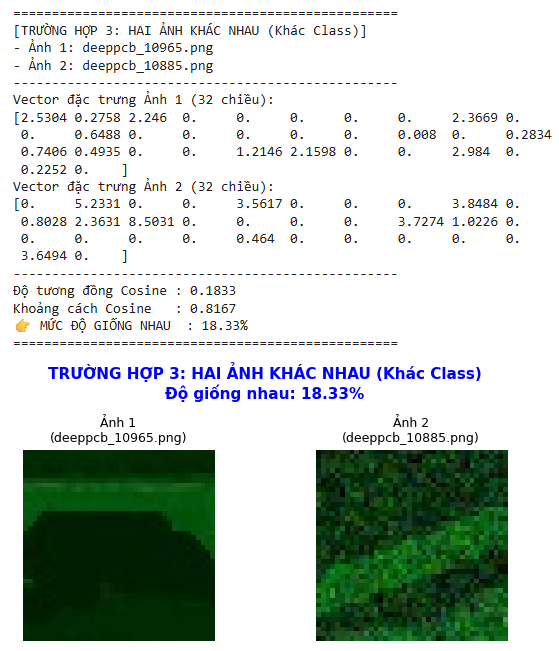

## Với tập ảnh UNO

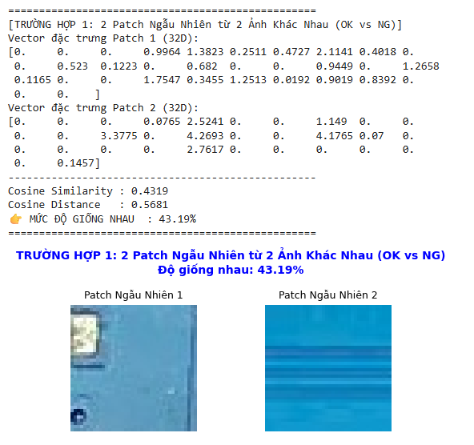
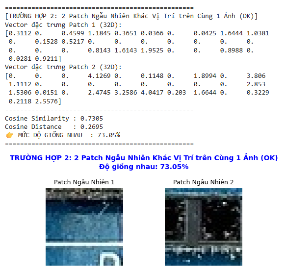
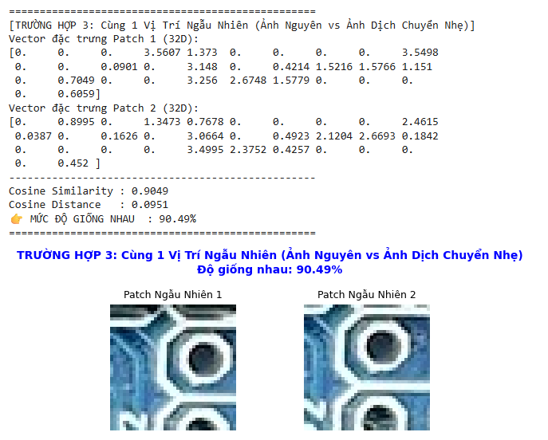